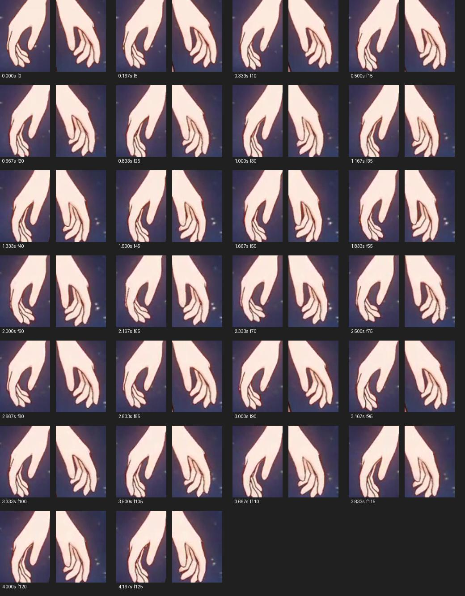
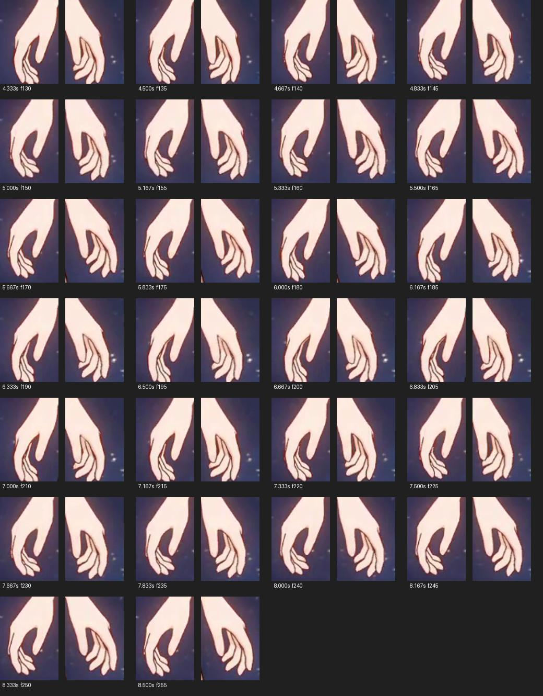

# 视频手部待机适配

参考：用户提供的 `c199e454222b44c1505b246aefca23ac.mp4`，578×366、30 fps、约 8.67 秒。

先抽取 24 张整体画面对照身体与手部关系，再按每 5 帧取一帧，检查 52 组双手特写（约每 0.167 秒一组，0–8.5 秒）。下面保留带时间和帧号的两张联系表，便于以后继续调节；原视频和模型文件不修改。

## 观察

| 第一轮时间 | 画面中的变化 | 适配方式 |
| --- | --- | --- |
| 0–0.5 秒 | 手掌处于摆动一端，四指弯曲且彼此错落 | 保持自然弧形，不伸直成板状 |
| 0.5–1.2 秒 | 双手随手臂缓慢移向另一端 | 手腕小幅连续旋转 |
| 1.2–1.7 秒 | 接近另一端，移动减慢，手指轮廓基本稳定 | 保留停缓节奏，手指只做极小变化 |
| 1.7–2.4 秒 | 手腕逐渐返回 | 连续插值，不突然反向 |
| 2.4–2.9 秒 | 接近开始状态 | 循环位置与速度连续 |
| 约 2.9–5.8、5.8–8.67 秒 | 相似运动再次出现 | 以约 2.9 秒作为手部参考周期 |

运动的主要来源是手臂/手腕整体摆动；四指一直保持松弛弯曲，拇指与其他手指留有间距。画面分辨率有限，部分关节有遮挡，无法据此精确恢复三维骨骼角度。以下参数是视觉参考下的手工适配，52 组观察帧不等于 52 组实测三维姿态。

## 实现

- 保留现有身体待机，在手腕上叠加小幅屈曲和侧摆；手指用独立基础弧度，越靠小指越弯，拇指幅度更小。
- `HAND_IDLE_KEYS` 使用 18 个曲线控制点、约 2.9 秒循环，经周期 Catmull–Rom 三次插值。左右手差 0.12 秒，各指再少量错开；不会随机抽动。
- 按模型自身掌面建立弯曲轴，朝掌内屈曲；不使用不同导出模型可能不一致的固定局部轴。
- 每帧身体待机重采样后再叠加手腕；手指从保存的基础姿势重算，避免角度累积。场景动作随后采样，保留原有进入和退出过渡。
- “减少动态”停止手部变化并保留松弛手型；不改变口型、眨眼或服装摆动的管理方式。

验证包括：曲线各控制点及循环处的位置/速度连续、幅度边界、长时间无旋转累积、减少动态静态姿势、场景动作覆盖及退出过渡。浏览器近景检查用于确认实际掌内弯曲方向。
