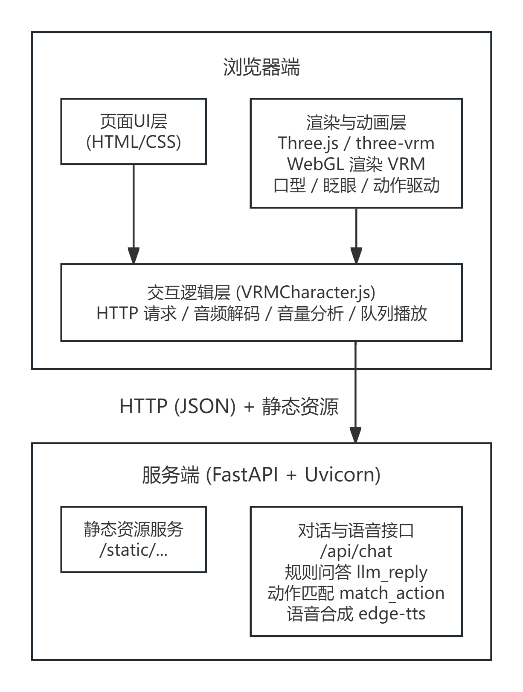

# 数字人交互系统 技术设计文档

| 项目名称 | 数字人交互系统（拟人化数字人 + 语音交互） |
|---------|--------------------------------------|
| 文档类型 | 技术设计文档（Technical Design Document） |
| 版本 | v1.1 |
| 日期 | 2026-09-03 |

---

## 1. 概述

本系统是一个浏览器端的三维数字人交互应用，支持文字或浏览器语音输入。服务端通过本地规则推进健康查询、预警和模拟预约流程，分句合成语音，并使用 Rhubarb 分析口型时间轴；前端结合音频能量驱动嘴型，同时叠加眨眼、头部微动和动作。模型可选加载，语音或口型分析不可用时提供逐句播报和近似口型降级。

系统使用"对话 + 语音合成"的服务思路，并采用"Three.js + VRM 三维渲染"方案。

---

## 2. 系统架构

### 2.1 整体架构

系统采用 B/S 架构，服务端负责规则对话、语音合成和口型时间轴分析；三维渲染、音频播放和逐帧表情权重更新在浏览器端完成。

### 2.2 技术底座

项目基于以下框架构建：

- 渲染引擎：Three.js 0.180.0（基于 WebGL 的 3D 图形库）。
- 数字人加载：@pixiv/three-vrm 3.5.5（VRM 模型加载与表情/骨骼控制库，含 VRMAnimationLoaderPlugin 用于加载 .vrma 动作）。
- Web 服务框架：FastAPI + Uvicorn（Python 异步 Web 框架）。
- 语音合成：edge-tts（微软 Azure 神经网络语音，在线免费）。

---

## 3. 技术选型

|
层次
| 技术 | 选型理由 |
|--------|------|---------|
|  前端语言  | HTML5 / CSS3 / JavaScript (ES6+) | 浏览器原生，无需构建工具 |
|  模块化  | ES Module + Import Map | 通过 CDN 引入依赖，免打包、开箱即用 |
|  3D 渲染  | Three.js 0.180.0 | 成熟 WebGL 库，生态完善 |
|  模型加载  | @pixiv/three-vrm 3.5.5 | VRM 专用加载器，提供表情与骨骼接口 |
|  动作加载  | VRMAnimationLoaderPlugin + AnimationMixer | 加载 .vrma 动作文件并通过 Mixer 播放 |
|  相机控制  | OrbitControls（three/addons） | 鼠标拖动旋转、滚轮缩放查看模型 |
|  音频处理  | Web Audio API (AnalyserNode) | 实时获取播放音频能量谱，用于口型驱动 |
|  后端框架  | FastAPI | 异步、类型友好、自带静态文件服务 |
|  语音合成  | edge-tts | 免费在线合成，中文音色自然，无需本地模型/GPU |
|  数据格式  | JSON / Base64(WAV/MP3) | 与前端 fetch + decodeAudioData 直接对接 |

---

## 4. 模块详细设计

### 4.1 服务端模块（vrm_server.py）

模块职责：提供静态资源托管、对话接口、动作匹配与语音合成。

关键组件：

- StaticFiles（挂载 `/static`）：托管前端页面与 JS，并对 `.js` 显式注册 `text/javascript` MIME 类型，确保浏览器正确执行 ES Module（Windows 下 Python 默认缺失该映射）。
- `build_reply(text, context)`：根据文本与流程状态返回回复、动作、快捷选项和新状态。预约支持科室、时间、最终确认三个步骤，任意步骤均可取消并清空状态；`llm_reply` 仅为兼容包装。
- `ACTION_RULES` / `match_action(text)`：保留的关键词匹配工具；当前对话接口直接使用 `build_reply` 返回的动作。
- `tts_to_mp3(text)`：调用 edge-tts，将单句文本合成为 MP3 音频字节流。
- `split_sentence(text)`：按中英文标点将回复拆分为若干短句，实现逐句合成与播报。
- 每个请求最多同时处理 3 个句子，单句 TTS 超时为 15 秒，结果按原文顺序返回。PyAV 转码及 Rhubarb 子进程在线程池内执行，避免阻塞事件循环；Rhubarb 超时为 10 秒，工作线程负责清理自己的临时目录。
- 接口仍一次性返回 JSON，并非流式接口。`/api/chat` 的 `tts_available` 表示本次至少有一句生成了在线音频；`/api/health` 的同名字段仅表示 edge-tts 依赖已安装，不保证在线服务可达。

### 4.2 前端页面模块（VRMCharacter.html）

- 使用 Import Map 声明 three、three/addons、@pixiv/three-vrm 三个外部依赖的 CDN 地址。
- 布局包含：3D 舞台、加载提示遮罩、工具栏（选择模型 / 打招呼 / 播放动作 + .vrma 文件选择器）、对话区（气泡列表 + 输入框）。
- 通过 `<script type="module">` 引入主逻辑 JS。

### 4.3 渲染与动画模块（VRMCharacter.js）

核心逻辑分层：

- 场景初始化（initThree）：创建 WebGL 渲染器、透视相机、环境光与方向光，开启逐帧渲染循环；初始化 OrbitControls 以支持鼠标旋转缩放。
- 模型加载（loadVrm）：使用 GLTFLoader + VRMLoaderPlugin 解析 `.vrm`，移除冗余骨骼，加入场景并设置 LookAt 目标为相机。
- 动作加载（loadVrmAnimation）：使用 GLTFLoader + VRMAnimationLoaderPlugin 解析本地 `.vrma` 文件，通过 AnimationMixer 创建 clipAction 并循环播放（LoopRepeat）。
- 动作触发（playActionByName）：按动作名从 `animations/{name}.vrma` 加载动作文件，以 LoopOnce + clampWhenFinished 播放一次，播完清除 activeAction 恢复待机。
- 表情控制（setExpression）：通过 `expressionManager.setValue` 驱动 BlendShape 权重，采用 try/catch 容错模型缺失的表情预设。

### 4.4 口型驱动模块

口型同步采用时间轴优先、音量或近似动画降级的方案：

1. 后端返回的 Base64 音频经 `decodeAudioData` 解码为 AudioBuffer。
2. 播放时创建 AnalyserNode 并连接音源，获取时域波形数据。
3. 每帧计算均方根能量（RMS），映射为嘴部开合度（0~1）。
4. 有 Rhubarb 时间轴时按 `start` / `end` 选择口型（aa / ih / ou / ee / oh），静音片段及时间轴间隙闭嘴。
5. 时间轴为空时，每 130ms 轮换元音，配合实际音频 RMS 驱动开合。
6. 单句缺少音频或解码、播放失败时，等待浏览器语音播报该句后继续下一句，避免跳句或重复播报。浏览器播报无法提供 PCM，使用近似节奏口型，在结束或错误时复位。两种播报均不可用时显示文字提示。

数据流：

    音频缓冲 -> AnalyserNode.getByteTimeDomainData -> RMS 能量 -> 开合度
        -> 时间轴选择口型（缺失时轮换元音） -> expressionManager.setValue(口型, 开合度)

### 4.5 动作与微表情模块

- 自动眨眼：按"睁眼 2.2~4.8s 随机 + 闭眼 240ms"周期，通过时间参数驱动 blink 权重。
- 头部动作：静默时头部 yaw 方向做缓慢正弦摆动；说话且口型开合时叠加轻微点头（pitch）。
- 挥手动作：点击"打招呼"后，前 30% 时间将右上臂外展抬起，随后手腕做正弦摆动，2.6s 后复位。
- .vrma 动作播放：手动加载时循环播放（LoopRepeat）；对话关键词触发时播放一次（LoopOnce + clampWhenFinished），播完恢复待机。动作通过 AnimationMixer 驱动，每帧调用 mixer.update(dt) 推进。

---

## 5. 关键接口设计

### 5.1 对话接口 POST /api/chat

请求体（JSON）：

    { "text": "帮我预约挂号", "context": {} }

响应体（JSON）：

    {
      "reply": "好的，我们先选择科室。这是本地流程演示，不会连接医院或真实挂号。",
      "action": "booking",
      "quick_replies": ["内科", "外科", "康复科", "体检中心", "取消预约"],
      "context": { "flow": "appointment", "step": "department" },
      "tts_available": false,
      "segments": [
        { "text": "好的，我们先选择科室。", "audio": "", "visemes": [], "visemeTimeline": [] },
        { "text": "这是本地流程演示，不会连接医院或真实挂号。", "audio": "", "visemes": [], "visemeTimeline": [] }
      ]
    }

其中 `action` 为匹配到的动作名（如 greet / booking / thanks / explain），无匹配时为 null。前端收到非空 action 时自动加载并播放 `animations/{action}.vrma`。

以上为无在线音频、未安装拼音依赖时的响应示例。成功时 `audio` 为 Base64 MP3，`visemeTimeline` 为包含 `start`、`end`、`viseme` 的数组。前端将返回的 `context` 随下一次请求传回；状态不落库，刷新页面后重置。

接口流程：接收文本与状态 → build_reply 返回回复和动作 → 分句 → 限制并发合成与线程池分析 → 按句序打包返回。

### 5.2 静态资源服务 GET /static/...

- `/static/VRMCharacter.html`：主页面。
- `/static/js/VRMCharacter.js`：前端主逻辑（Content-Type 为 `text/javascript`）。
- `/static/animations/*.vrma`：动作文件，由前端按需加载。

---

## 6. 核心业务流程

### 6.1 对话完整链路

    用户输入文本
      -> 前端 fetch POST /api/chat
      -> 后端 build_reply 生成回复、动作与新状态
      -> split_sentence 分句
      -> 限制并发 tts_to_mp3 合成，在线程池分析口型
      -> 返回 { reply, action, quick_replies, context, segments, tts_available }
      -> 前端展示 reply 文本
      -> 若 action 非空，调用 playActionByName 触发动作
      -> 按句序 decodeAudioData 播放，单句失败改用浏览器语音
      -> 播放同时驱动口型与表情

### 6.2 模型加载链路

    点击"选择模型" -> 本地文件对话框 -> URL.createObjectURL
      -> GLTFLoader + VRMLoaderPlugin 解析 .vrm
      -> VRMUtils.removeUnnecessaryJoints
      -> 加入场景，设置 LookAt，隐藏加载遮罩

### 6.3 动作触发链路

    对话关键词触发：
      用户输入文本 -> /api/chat -> build_reply 返回 action 名
      -> 前端 playActionByName(action) -> 加载 animations/{action}.vrma
      -> VRMAnimationLoaderPlugin 解析 -> AnimationMixer.clipAction
      -> LoopOnce + clampWhenFinished 播放一次 -> 播完恢复待机

    手动加载触发：
      点击"播放动作" -> 选择本地 .vrma -> loadVrmAnimation
      -> LoopRepeat 循环播放

---

## 7. 目录结构

    vrm_demo/
    ├── vrm_server.py          # FastAPI 服务端（对话 + TTS + 动作匹配 + 静态托管）
    └── static/
        ├── VRMCharacter.html  # 主页面
        ├── js/
        │   └── VRMCharacter.js # 前端渲染、口型、动作、交互逻辑
        └── animations/        # .vrma 动作文件目录（greet/booking/thanks/explain.vrma）
            └── README.txt     # 动作文件命名说明

---

## 8. 部署与运行

### 8.1 环境准备

    pip install fastapi uvicorn pydantic edge-tts

### 8.2 启动服务

    python vrm_server.py

（如系统存在多解释器，需使用实际安装依赖的解释器，例如 `D:\anaconda\python.exe`。）

### 8.3 访问

浏览器打开：`http://localhost:8890/static/VRMCharacter.html`

### 8.4 注意事项

- 页面首屏会显示"请点击左上角「选择模型」"，需手动选择本地 `.vrm` 文件。
- 语音合成依赖 edge-tts 在线服务，需保持网络连通。
- 若页面按钮无响应，通常是 `.js` 被浏览器以错误缓存命中，强制刷新（Ctrl+Shift+R）即可。
- 关键词触发动作需要将对应 `.vrma` 文件按命名放入 `vrm_demo/static/animations/` 目录；文件缺失时对话正常但不播放动作。

---

## 9. 后续扩展设计

1. 接入大语言模型：将 `llm_reply` 替换为 OpenAI 兼容接口（可参考原项目 `voiceapi/llm.py`），提升对话智能程度。
2. 接入语音识别（ASR）：沿用原项目 `/asr` WebSocket 方案，实现语音输入闭环。
3. 更精细的口型：在现有 Rhubarb 时间轴基础上改进口型过渡与中文适配，校准不同模型的开合幅度。
4. 动作库扩展：当前已支持 .vrma 动作文件与关键词触发，后续可引入动作捕捉数据、动作混合（blend）与优先级调度，实现更丰富的肢体动作。
5. 形象库：预置多个 VRM 模型，支持一键切换数字人形象。
